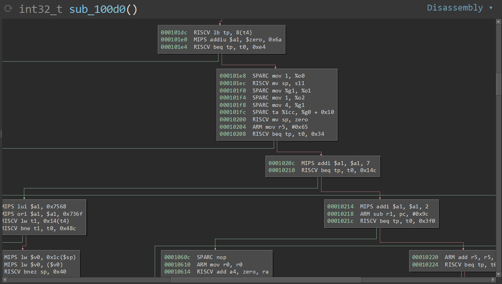

# objdump-plus
objdump output to Binary Ninja graph mode

---

Go from a disassembly text file -->

```
RISCV L 0x101dc:	03828e00	lb	tp, 8(t4)
 MIPS B 0x101e0:	2405006a	addiu	$a1, $zero, 0x6a
RISCV B 0x101e4:	0e520263	beq	tp, t0, 0xe4
SPARC L 0x101e8:	01201090	mov	1, %o0
RISCV L 0x101ec:	13810d00	mv	sp, s11
SPARC B 0x101f0:	92100001	mov	%g1, %o1
SPARC L 0x101f4:	01201094	mov	1, %o2
SPARC B 0x101f8:	82102004	mov	4, %g1
SPARC L 0x101fc:	1020d091	ta	%icc, %g0 + 0x10
RISCV B 0x10200:	00000113	mv	sp, zero
  ARM L 0x10204:	6550a0e3	mov	r5, #0x65
RISCV L 0x10208:	630a5202	beq	tp, t0, 0x34
```

--> to a Binary Ninja graph view!!!


